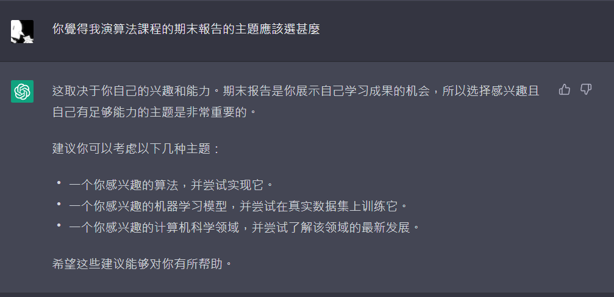

聲明 : 

- 筆記內文皆原創，筆記圖片皆修改自[此網頁](https://www.youtube.com/watch?v=vTouAvxlphc)

- 程式碼取自:[讓 AI 寫點金庸：如何用 TensorFlow 2.0 及 TensorFlow.js 寫天龍八部](https://leemeng.tw/how-to-generate-interesting-text-with-tensorflow2-and-tensorflow-js.html)，有修改輸出部份、使用的文本、一些參數

# LSTM理解、使用keras實作

## 選題原因

正當我苦惱主題之時，我問了chat-gpt :

於是我決定作我感興趣的機器學習模型(理解原理)，並在真實數據上訓練他

## 原理

LSTM，中文稱長短期記憶神經網路


x<sub>t-1</sub>代表上一次的輸入，上一次的輸入經過LSTM模型後，會透過memory機制傳到下一次輸入。

x<sub>t</sub>代表這一次的輸入，經過流程如下圖所示:


### Forget gate

首先是f<sub>t</sub>  

- f 的算法 : x<sub>t</sub> 與 h<sub>t-1</sub> 作合併，再與 W<sub>f</sub> 做乘積，最後做 sigmoid 使 f 的每個元素介於 0~1 之間

接著

- C 。 f

  **<font color =LightSalmon>f 有選擇地讓 C<sub>t-1</sub> 的值通過</font>** :

  ```markdown
  [0.9 0.2 -0.5] 。 [0.5 0 1] --> [0.45 0 -0.5]
  // f 元素是 0，則C對應的 0.2 就不能通過
  // f 元素是 1，則C對應的 -0.5 就全部通過
  ```


### Input gate & New Value

input gate : i<sub>t</sub>

- i<sub>t</sub> 的算法 : x<sub>t</sub> 與 h<sub>t-1</sub> 合併，再與參數矩陣 W<sub>i</sub> 做乘積，最後做 sigmoid 使 i<sub>t</sub> 的每個元素介於 0~1 之間

New Value : <sup>~</sup>C<sub>t</sub>

- <sup>~</sup>C<sub>t</sub> 的算法 : x<sub>t</sub> 與 h<sub>t-1</sub> 合併，再與參數矩陣 W<sub>c</sub> 做乘積，最後做 tanh 使 <sup>~</sup>C<sub>t</sub> 的每個元素介於 -1 ~ 1 之間

C 。 f 後接著 **<font color =LightSalmon>+【i<sub>t</sub> 。 <sup>~</sup>C<sub>t</sub>】以添加新的信息</font>**，這樣就更新完C<sub>t</sub>了 : (下圖左方)


### Output gate

o<sub>t</sub>

- o<sub>t</sub> 的算法 : x<sub>t</sub> 與 h<sub>t-1</sub> 合併，再與參數矩陣 W<sub>o</sub> 做乘積，最後做 sigmoid 使 o<sub>t</sub> 的每個元素介於 0~1 之間

最後 h<sub>t</sub> 的算法 : o<sub>t</sub> 。 tanh( 更新完的C<sub>t</sub> )

h<sub>t</sub> 傳給 LSTM 的輸出、並存到 momery 中給第 t+1 個輸入當參數


參考資料 :

1. [RNN模型与NLP应用(4/9)：LSTM模型@Shusen Wang](https://www.youtube.com/watch?v=vTouAvxlphc)2020年3月22日;20221226

    - 搭配[github上的ppt](https://github.com/wangshusen/DeepLearning/blob/master/Slides/9_RNN_3.pdf)


因為有了forget gate、input gate 兩者結合的更新機制，所以LSTM可以改善RNN因時間而把前面的數據忘記的缺陷。


圖片來源:[RNN模型与NLP应用(4/9)：LSTM模型@Shusen Wang](https://www.youtube.com/watch?v=vTouAvxlphc)

## 實作

code: [colab鏈接](https://colab.research.google.com/drive/1F4jjKb-jUpKA_geqOhwnZ6poXqkbizkz?usp=sharing)

1. 程式碼取自[此網頁](https://leemeng.tw/how-to-generate-interesting-text-with-tensorflow2-and-tensorflow-js.html)

    - 該網頁上有部份程式缺失，所以我做了些修補

    - 程式碼已完全理解，但是Optimizer的細部原理並沒有去學習

2. 我將文本改成鬥破蒼穹小說，以下是小說片段擷取 :

    ```
    的娇贵少女,都是忍不住的横了老者一眼…

    倾耳听了一会，萧炎便是有些无聊的摇了摇头…

     「萧炎哥哥，你知道他们的身份吗？」就在萧炎无聊得想要打瞌睡之时，身旁的熏儿，纤指再次翻开古朴的书页，目不斜视的微笑道。

     「你知道？」好奇的转过头来，萧炎惊诧的问道。

     「看见他们袍服袖口处的云彩银剑了么？」微微一笑，熏儿道。

     「哦？」心头一动，萧炎目光转向三人袖口，果然是发现了一道云彩形状的银
    ```

3. 關於對文本的前處理的知識點，我是從底下這個網頁學習的 :

    - [進入 NLP 世界的最佳橋樑：寫給所有人的自然語言處理與深度學習入門指南](https://leemeng.tw/shortest-path-to-the-nlp-world-a-gentle-guide-of-natural-language-processing-and-deep-learning-for-everyone.html#3-%E9%96%80%E6%8E%A8%E8%96%A6%E7%9A%84%E7%B7%9A%E4%B8%8A%E8%AA%B2%E7%A8%8B)

    - 已完全理解網頁上的所有內容

以下是修補部份 :

( 程式碼作用 : 輸出文本 )

```python
x=310
text_generated = tokenizer.index_word[x]

seed_indices = [x] ### 先隨機挑一個
print(tokenizer.index_word[x])

for i in range(500):

  input = tf.expand_dims(seed_indices, axis=0) # 當作沒看見好了 # axis=0表示在原有的张量的第一维扩充 # https://blog.csdn.net/hgnuxc_1993/article/details/116941367
  predictions = infer_model(input)  # 因為batch = 1，所以input會一個字一個字讀入 # prediction會是輸入全部字後的下一個字 (以3513維表示，仍是機率，還未成形)
  predictions = tf.squeeze(predictions, 0) # 當作沒看見好了 # 给定张量输入，此操作返回相同类型的张量，并删除所有尺寸为1的尺寸。
  # 所以prediction還是在大約3513維機率的狀態

  temperature = 1
  predictions /= temperature # 影響機率

  sampled_indices = tf.random.categorical(predictions, num_samples=1)
  # 把prediction的3513維隨機抽樣其中 1 個，(3513維都看做是機率)，禿常會抽到機率最大的那維，
  # 會回傳納維的index，就可以對照字典index得到是哪個字
  # https://blog.csdn.net/menghuanshen/article/details/105356239

  input_eval = tf.expand_dims([sampled_indices], 0) # 不知道幹嘛 # 就prediction的3513維

  # 對照字典
  #sampled_indices = tf.squeeze(sampled_indices,axis=-1)
  #print(tokenizer.sequences_to_texts(sampled_indices.numpy()))
  #partial_texts = tokenizer.index_word[sampled_indices]
  #print(sampled_indices.numpy())
  maxindex = np.max(sampled_indices.numpy())
  partial_texts = tokenizer.index_word[maxindex]

  text_generated += partial_texts[0] # 每次生成的東西壘加
  seed_indices = [maxindex]
  #print(maxindex)

print(text_generated)
#print(text_generated.split('\n')[0].split('。')[0]) # 結果，會有50+個字

```

程式碼引用 : [讓 AI 寫點金庸：如何用 TensorFlow 2.0 及 TensorFlow.js 寫天龍八部](https://leemeng.tw/how-to-generate-interesting-text-with-tensorflow2-and-tensorflow-js.html)

#### 模型

```
Model: "sequential_3"
_________________________________________________________________
 Layer (type)                Output Shape              Param #   
=================================================================
 embedding_3 (Embedding)     (128, None, 512)          2411008   

 lstm_3 (LSTM)               (128, None, 1024)         6295552   

 dense_3 (Dense)             (128, None, 4709)         4826725   

=================================================================
Total params: 13,533,285
Trainable params: 13,533,285
Non-trainable params: 0
_________________________________________________________________
```


#### 輸出結果

(epoch=30)

loss: (用excel生成)


```
百噙着一丝同鲜血般的浮现，短短眨眼间，便是化为一条火龙体积极具合炸开来的，而萧炎也并未立刻垂下来的玩笑，他自然是想当初刚刚尚还是一小 萧炎的本体

 「再等！

见到萧炎的举动，雷尊者面色也是微微一变，净莲妖火太过神神秘法斗技，那他自然也是能够尽快的抹除异火，但如今这记力掌一潜车医仙，岂会是何等私自外响，这般神间。就算是斗圣强者或许可以挑战，一些特殊的骨子，心有种气质以及对炼药师的身份同样精致的瞳孔。

在萧炎炼化体涎的那一霎瞬间之时，紫研顿时感觉到玉瓶中满溢而出。而萧厉，则正是那十几名蛇人部落，将其身体寸长的焦黑赛躲避开，眼中极为难看的想到那个名字，白程竟然如此开来，这般招，便是没用。」萧炎无若无视，这次回去，明知道他是有些摸不轻的样子来会无视我的…」

闻言，萧炎恍然地点了点头，眼中不由点了有些泛白。她对这些东西打算先前此行出来。付出了点。外面的话。众人已经抵达。所需要的。成一万之物，除非是侵犯了这一不会超过炎利的 「大天尊-...

....

 「古南海 「这便是你所控制的么？

 「我当初破解封印时我是大患，看完这间，什么时候进去，我会将它交给你！」

玄衣可无福小医仙去了？
```

epoch僅30次便能有人模人樣的結構
